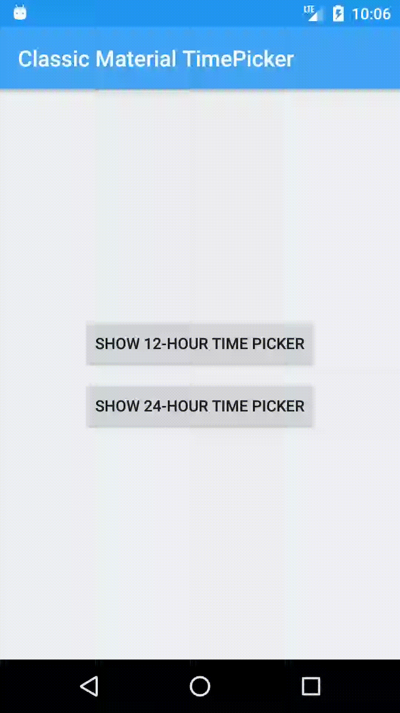
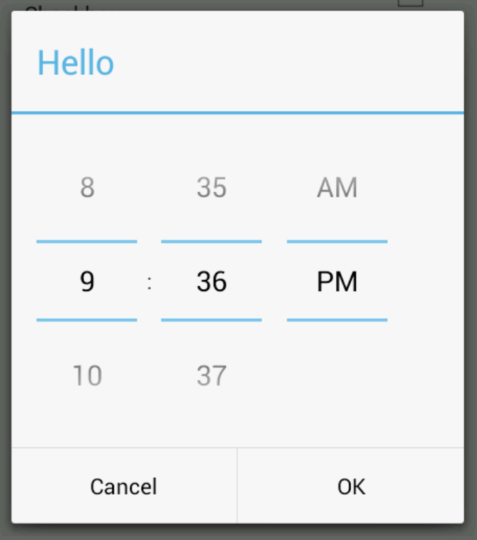

[](http://developer.android.com/index.html)
[](https://android-arsenal.com/api?level=19)
[](https://jitpack.io/#michaldrabik/classicmaterialtimepicker)

Classic Material Time & Date Picker
===========

Simple, customisable Time and Date Picker created in the "old" Android API 16 style.

Restyled with **Material 2.0** guidelines and powered by **RecyclerView.**

| **Classic Material TimePicker**|**"Old" Android Api 16 TimePicker**|
| ------------- |:-------------:|
||

**High Resolution Demo:**

https://giant.gfycat.com/LastingImpassionedGelada.webm

## Install
This library is being distributed via [JitPack](http://jitpack.io/). [AndroidX](https://developer.android.com/jetpack/androidx) libraries are required.

**Step 1:**  
Add Jitpack repository in root **build.gradle** at the end of repositories:
```groovy
allprojects {
  repositories {
   maven { url 'https://jitpack.io' }
  }
}
```

**Step 2:**  
Add dependency in app project:
```groovy
dependencies {
  implementation 'com.github.michaldrabik:classicmaterialtimepicker:1.1.3'
}
```

## Usage
This library can be used to pick time or a date. 

See [Sample App](https://github.com/michaldrabik/classicmaterialtimepicker/blob/master/app/src/main/java/com/michaldrabik/cmtpsample/MainActivity.kt) for full example.

### Time

Create and show time picker's [CmtpTimeDialogFragment](https://github.com/michaldrabik/classicmaterialtimepicker/blob/master/library/src/main/java/com/michaldrabik/classicmaterialtimepicker/CmtpTimeDialogFragment.kt):
```kotlin
val timePicker = CmtpTimeDialogFragment.newInstance()
timePicker.show(supportFragmentManager, "Tag")
```
Set initial time with `setInitialTime12()` or `setInitialTime24()` method:
```kotlin
val timePicker = CmtpTimeDialogFragment.newInstance()

// Set initial time and initialise time picker in 12-hour time format.
timePicker.setInitialTime12(5, 15, PM)

// Set initial time and initialise time picker in 24-hour time format.
timePicker.setInitialTime24(23, 30)

timePicker.show(supportFragmentManager, "Tag")
```

Selected time can be retrieved with one of the listeners:
```kotlin
val timePicker = CmtpTimeDialogFragment.newInstance()

// Set 12-hour time format listener.
// Use this listener if time picker was initialised in 12-hour format.
timePicker.setOnTime12PickedListener { time12 ->
  // Do something with picked time.
})

// Set 24-hour time format listener.
// Use this listener if time picker was initialised in 24-hour format.
timePicker.setOnTime24PickedListener { time24 ->
  // Do something with picked time.
})

timePicker.show(supportFragmentManager, "Tag")
```

### Date

Create and show date picker's [CmtpDateDialogFragment](https://github.com/michaldrabik/classicmaterialtimepicker/blob/master/library/src/main/java/com/michaldrabik/classicmaterialtimepicker/CmtpDateDialogFragment.kt):
```kotlin
val datePicker = CmtpDateDialogFragment.newInstance()
datePicker.show(supportFragmentManager, "Tag")
```

Set initial date with `setInitialDate()` method:
```kotlin
val datePicker = CmtpDateDialogFragment.newInstance()

// Set initial date.
datePicker.setInitialDate(10, 10, 2019)
datePicker.show(supportFragmentManager, "Tag")
```

Set custom separator with `setCustomSeparator()` method:
```kotlin
val datePicker = CmtpDateDialogFragment.newInstance()

// Set custom separator. "/" is a default.
datePicker.setCustomSeparator("-")
datePicker.show(supportFragmentManager, "Tag")
```

Set custom years range with `setCustomYearRange()` method:
```kotlin
val datePicker = CmtpDateDialogFragment.newInstance()

// Set custom years range.
datePicker.setCustomYearRange(2000, 2019)
datePicker.show(supportFragmentManager, "Tag")
```

Selected date can be retrieved with a listener:
```kotlin
val datePicker = CmtpDateDialogFragment.newInstance()

// Set date listener.
timePicker.setOnDatePickedListener { date ->
  // Do something with picked date.
})
timePicker.show(supportFragmentManager, "Tag")
```

[CmtpTimeDialogFragment](https://github.com/michaldrabik/classicmaterialtimepicker/blob/master/library/src/main/java/com/michaldrabik/classicmaterialtimepicker/CmtpTimeDialogFragment.kt) and [CmtpDateDialogFragment](https://github.com/michaldrabik/classicmaterialtimepicker/blob/master/library/src/main/java/com/michaldrabik/classicmaterialtimepicker/CmtpDateDialogFragment.kt) are being used as hosts for [CmtpTimePickerView](https://github.com/michaldrabik/classicmaterialtimepicker/blob/master/library/src/main/java/com/michaldrabik/classicmaterialtimepicker/CmtpTimePickerView.kt) and [CmtpDatePickerView](https://github.com/michaldrabik/classicmaterialtimepicker/blob/master/library/src/main/java/com/michaldrabik/classicmaterialtimepicker/CmtpDatePickerView.kt) views.

You can use those views by itself or host them in a different Android components (like [Bottom Sheet](https://developer.android.com/reference/android/support/design/widget/BottomSheetDialogFragment))

## Customization
Each element of the time picker can be customized:

**Dialog background**

Override following style in your app with your own background drawable:
```xml
<style name="CmtpDialogFrameStyle" parent="CmtpDialogTheme">
  <item name="android:windowBackground">@drawable/your_background_drawable</item>
</style>
```

**Dialog positive/negative button text**

Provide custom texts while creating DialogFragment's instance:
```kotlin
val timePicker = CmtpDialogFragment.newInstance("Pick Time", "Hide")
timePicker.show(supportFragmentManager, "TimePickerTag")
```

**Dialog positive button style**

Override following style in your app with your own text style:
```xml
<style name="CmtpDialogPositiveButtonStyle" parent="Widget.AppCompat.Button.ButtonBar.AlertDialog">
  <item name="android:textColor">#FF0000</item>
  <!-- other properties -->
</style>
```

**Dialog negative button style**

Override following style in your app with your own text style:
```xml
<style name="CmtpDialogNegativeButtonStyle" parent="Widget.AppCompat.Button.ButtonBar.AlertDialog">
  <item name="android:textColor">#FF0000</item>
  <!-- other properties -->
</style>
```

**Custom text frame drawable, text color and size**

Override following style in your app with your own text style:
```xml
<style name="CmtpViewTheme">
  <item name="cmtpTextFrameDrawable">@drawable/custom_text_frame</item>
  <item name="cmtpTextColor">#000000</item>
  <item name="cmtpTextSize">20sp</item>
</style>
```

See [Sample App styles](https://github.com/michaldrabik/classicmaterialtimepicker/blob/master/app/src/main/res/values/styles.xml) for an example of full customization.

## Release Notes
**1.1.4**

  - Fixed state restoration bug

**1.1.3**

  - Time values font size bugfix

**1.1.2**

  - Added custom separator `toString()` methods for `CmtpDate` and `CmtpTime` classes.<br>
  - Bugfixes
  
**1.1.1**

  - Apply minor bugfixes

**1.1.0**

  - Added Date picker (thanks to [@victorlsn](https://github.com/victorlsn))
  
**1.0.0**

  - Initial Release

## License

**Copyright 2019 Michal Drabik**

This program is free software: you can redistribute it and/or modify it under the terms of the GNU General Public License as published by the Free Software Foundation, either version 3 of the License, or (at your option) any later version.  
This program is distributed in the hope that it will be useful, but WITHOUT ANY WARRANTY;
without even the implied warranty of MERCHANTABILITY or FITNESS FOR A PARTICULAR PURPOSE.
See the GNU General Public License for more details.  
You should have received a copy of the GNU General Public License along with this program.   
If not, see [http://www.gnu.org/licenses/](http://www.gnu.org/licenses/).
